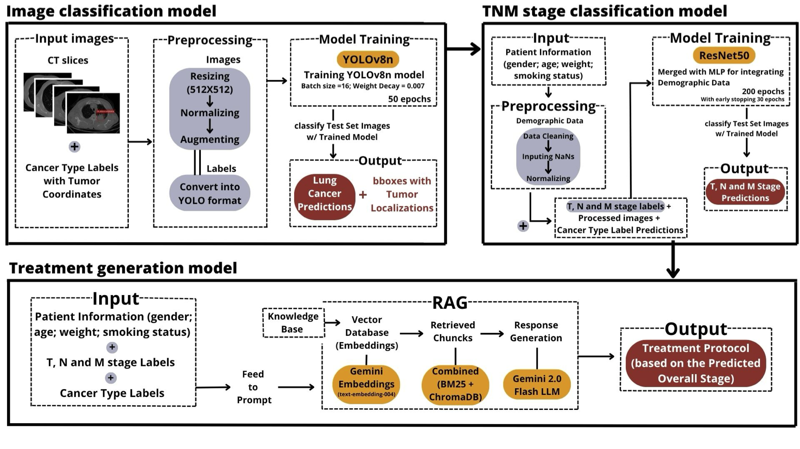

# Lung Cancer Multimodal Diagnostic, Staging, and Treatment Recommendation Framework

This project presents an end-to-end multimodal framework integrating tumor detection, TNM staging, and guideline-based treatment recommendations for lung cancer. The system unifies computer vision models with Retrieval-Augmented Generation (RAG) using modern LLMs.

## Table of Contents
1. [Project Overview](#1-project-overview)
2. [Methodology Visualization](#2-methodology-visualization)
3. [Installation & Setup](#3-installation--setup)
4. [Data Requirements](#4-data-requirements)
5. [Pipeline Phases](#5-pipeline-phases)
    - [5.1 Tumor Detection & Classification](#51-tumor-detection--classification)
    - [5.2 Multimodal TNM Staging](#52-multimodal-tnm-staging)
    - [5.3 Treatment Recommendation (RAG)](#53-treatment-recommendation-rag)
    - [5.4 Evaluation Suite](#54-evaluation-suite)
    - [5.5 General Utilities](#55-general-utilities)
6. [Included Models](#6-included-models)
7. [RAG Pipeline Technical Details](#7-rag-pipeline-technical-details)
8. [Evaluation Metrics](#8-evaluation-metrics)
9. [Reproducibility](#9-reproducibility)

## 1. Project Overview
Lung cancer remains a major cause of cancer-related mortality. Early diagnosis, accurate staging, and personalized treatment decisions are essential to improve outcomes. Current workflows are fragmented across detection, staging, and treatment planning.
This framework integrates all components:

- YOLOv8-based detection
- ResNet50-based multimodal TNM staging
- RAG-based treatment recommendations using clinical guidelines
- Evaluation suite covering staging, retrieval, and treatment quality

The full repository structure is available in `repo_structure.txt`.

## 2. Methodology Visualization
<p align="center">
  
  <br>
  <em>Framework Methodology: YOLOv8n, ResNet50 e Gemini 2.0 RAG</em>
</p>

---

## 3. Installation & Setup

### 1. Clone the repository
```bash
git clone https://github.com/Catarinacpns/Lung-Cancer-Pipeline-for-Classification-and-Treatment-Protocol-Generation.git
cd <repo_folder>
```

### 2. Create and activate a virtual environment
```bash
python3 -m venv venv
source venv/bin/activate
```

### 3. Install dependencies
```bash
pip install -r requirements.txt
```

### 4. Environment variables

Create a `.env` file:
```bash
touch .env
```

Add your API keys:
```bash
OPENAI_API_KEY=your_key
AZURE_OPENAI_KEY=your_key
GOOGLE_API_KEY=your_key
```

---

## 4. Data Requirements

This project requires:

- LUNG-PET-CT-DX dataset (TCIA)
- NSCLC-Radiomics dataset (TCIA)
- Clinical treatment guideline documents from NCCN, NCI, and ESMO
- Cleaned and chunked embeddings stored in ChromaDB or zipped archives

Datasets must follow the structure referenced in `repo_structure.txt`.

---

## 5. Pipeline Phases

The framework is organized into four sequential phases. While experimental logic and execution are handled via **Jupyter Notebooks**, the `src/` directory contains modular helper scripts that power the underlying engine.

### 5.1 Tumor Detection & Classification (YOLOv8)

Identifies the presence of nodules, provides bounding box localizations, and classifies the cancer type.
* **Notebooks:**
    - **Preprocessing:** `notebooks/01_yolov8_cancer_classification/01_LUNGPETCT_data_preprocessing.ipynb`
    - **Image Prep:** `02_LUNGPETCT_image_preprocessing.ipynb` to `05_preprocessing_LUNGPET_NSCLC.ipynb`
    - **Model Training:** `07_yolov8_model_training.ipynb`
    - **Evaluation:** `08_yolov8_model_eval.ipynb`
* **Supporting Scripts:**
    - `src/preprocessing/dicom_io.py` & `xml_parsing.py`: Handling raw medical imaging formats.
    - `src/preprocessing/rtstruct/`: Suite for converting RTStruct annotations to YOLO format.
    - `src/augmentation/augmentation_yolo.py`: Custom medical image augmentations.
    - `src/visualization/yolo_visualization.py`: Utilities to overlay predictions on CT slices.
    - *Note: Scripts in `models/yolo_resnet` represent experimental attempts to integrate a ResNet backbone into the YOLO architecture.*

### 5.2 Multimodal TNM Staging (ResNet50 + MLP)

Predicts T, N, and M stages by fusing deep visual features from CT scans with clinical patient data (age, weight, smoking status).
* **Notebooks:**
    - **Data Processing:** `notebooks/02_resnet50_tnm_staging/01_data_processing_TNM_stage.ipynb`
    - **Image Processing:** `02_image_processing_TNM_stage.ipynb`
    - **Multimodal Staging:** `03_resnet50_TMN.ipynb`
* **Supporting Scripts:**
    - `src/modeling/resnet50/datasets/lung_cancer_multimodal.py`: Handles the fusion of image and tabular clinical data.
    - `src/splitting/dataset_splitting.py`: Manages patient-wise data stratification.
    - `src/optimization/loaders/data_loader.py`: Optimized loaders for training multimodal networks.

### 5.3 Treatment Recommendation (RAG)

Generates evidence-based treatment protocols by retrieving medical guidelines through a vector search engine.
* **Notebooks:**
    - **RAG Pipeline & Generation:** `notebooks/03_llm_treatment_generation/01_LLM_preprocessing.ipynb`
* **Supporting Scripts:**
    - `src/preprocessing/nlp/`: Scripts for PDF parsing and web scraping (NCCN/ESMO guidelines).
    - `src/nlp/rag/chunking.py` & `retrieval.py`: Token-based segmentation and hybrid search logic.
    - `src/nlp/rag/chromadb.py`: Manages vector store persistence and embedding storage.
    - `src/nlp/api/gemini_2flash.py`: Interface for Gemini 2.0 Flash integration.

### 5.4 Evaluation Suite
Comprehensive assessment of staging accuracy and LLM-generated treatment quality.
* **Notebooks:**
    - **Quantitative Evaluation:** `notebooks/03_llm_treatment_generation/02_LLM_evaluation.ipynb`
* **Supporting Scripts:**
    - `src/nlp/eval/generate_responses_utils.py`: Utilities for batch-generating LLM responses for large-scale testing.
    - `src/nlp/eval/eval_responses_utils.py`: Logic for scoring clinical accuracy and grounding.
    - `src/nlp/eval/ragas_set_up.py`: Integration with RAGAS metrics (Faithfulness, Relevancy).

### 5.5 General Utilities
Core utilities used across all pipeline stages:
- `src/optimization/utils/reproducibility.py`: Ensures deterministic results via global seed control.
- `src/statistics/patient_label_statistics.py`: Dataset analysis and clinical distribution reporting.
- `src/utils/file_utils.py`: General I/O and directory management.

---

## 6. Included Models

* **YOLOv8 Variants:** Nano and Small architectures.
* **ResNet50 TNM Models:** Multimodal integration of imaging + clinical metadata using ImageNet pretrained backbones.
* **Embedding Models:** MiniLM, OpenAI `text-embedding-3-small`, and Google Gemini embeddings.
* **Generative LLMs:** GPT-4o mini, Azure OpenAI models, and **Gemini 2.0 Flash**.

---

## 7. RAG Pipeline Technical Details

1.  **Document Processing:** HTML stripping, PDF parsing, and metadata normalization for NCCN/ESMO guidelines.
2.  **Chunking:** Token-based segmentation with overlapping windows to preserve clinical context.
3.  **Embedding Generation:** Batch processing with rate-limit handling and retry logic.
4.  **Vector Storage:** ChromaDB collections organized by model type and chunk size.
5.  **Retrieval:** Hybrid strategy combining **BM25 keyword search** with **Cosine Similarity vector search**.
6.  **Generation:** Prompt engineering for structured treatment protocols with strict evidence grounding.

---

## 8. Evaluation Metrics

### Computer Vision & Staging (YOLOv8 & ResNet50)
* **Detection (YOLO):**
    * **mAP@0.5:** Mean Average Precision for detection accuracy.
    * **IoU:** Intersection over Union for localization quality.
    * **Accuracy, Precision, Recall, & F1:** For cancer type classification.
* **Clinical Staging:**
    * **Cohen’s Kappa:** Measures agreement between predicted and ground-truth stages (accounts for class imbalance).

### Treatment Recommendation & RAG (LLM)
* **Semantic & Textual Similarity:**
    * **BERTScore (Preferred):** Semantic similarity via contextual embeddings; handles clinical phrasing variations better than traditional overlap metrics.
    * **ROUGE-L:** Longest common subsequence overlap.
* **RAGAS Framework:**
    * **Faithfulness:** Support of generated treatment by retrieved chunks.
    * **Answer Relevancy:** How well the response addresses the prompt.
    * **Context Precision & Recall:** Evaluation of retrieval quality from the medical vector store.

 > [!TIP]
> **Results:** All LLM evaluation outputs, including RAGAS metrics and CSV reports, can be found in `evaluation/Final_eval/`.

---

## 9. Reproducibility

To ensure deterministic results across all experiments, the framework uses the utility in:
`src/optimization/utils/reproducibility.py`

This enforces:
* Global seed fixing (NumPy, PyTorch, Python Random).
* Deterministic algorithms for CUDA/PyTorch operations.
* Consistent dataset splitting via patient-ID hashing.
