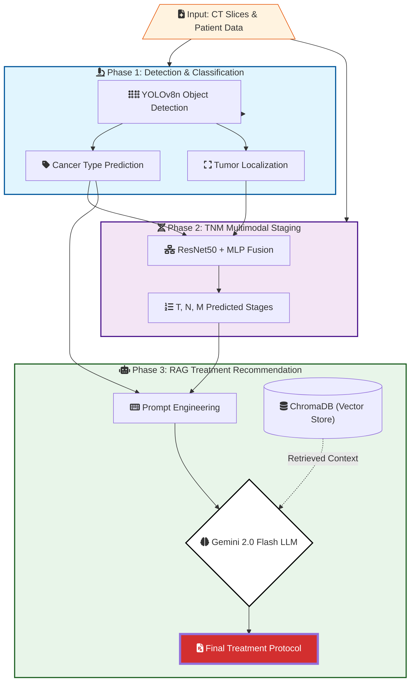

# Lung Cancer Multimodal Diagnostic, Staging, and Treatment Recommendation Framework

This project presents an end-to-end multimodal framework integrating tumor detection, TNM staging, and guideline-based treatment recommendations for lung cancer. The system unifies computer vision models with Retrieval-Augmented Generation (RAG) using modern LLMs.

## Overview

Lung cancer remains a major cause of cancer-related mortality. Early diagnosis, accurate staging, and personalized treatment decisions are essential to improve outcomes. Current workflows are fragmented across detection, staging, and treatment planning.
This framework integrates all components:

- YOLOv8-based detection
- ResNet50-based multimodal TNM staging
- RAG-based treatment recommendations using clinical guidelines
- Evaluation suite covering staging, retrieval, and treatment quality

The full repository structure is available in `repo_structure.txt`.

## Methodology Overview



---

## Installation

### 1. Clone the repository
```bash
git clone <repo_url>
cd <repo_folder>
```

### 2. Create and activate a virtual environment
```bash
python3 -m venv venv
source venv/bin/activate
```

### 3. Install dependencies
```bash
pip install -r requirements.txt
```

### 4. Environment variables

Create a `.env` file:
```bash
touch .env
```

Add your API keys:
```bash
OPENAI_API_KEY=your_key
AZURE_OPENAI_KEY=your_key
GOOGLE_API_KEY=your_key
```

---

## Data Requirements

This project requires:

- LUNG-PET-CT-DX dataset
- NSCLC-Radiomics dataset
- Clinical treatment guideline documents from NCCN, NCI, and ESMO
- Cleaned and chunked embeddings stored in ChromaDB or zipped archives

Datasets must follow the structure referenced in `repo_structure.txt`.

---

## Pipeline Overview

### 1. Tumor Detection
- `notebooks/01_yolov8_cancer_classification/`
- `src/preprocessing/`
- `src/models/yolo/`

### 2. TNM Staging
- `notebooks/02_resnet50_tnm_staging/`
- `src/modeling/resnet50/`
- `src/training/ResNet50/`

### 3. Treatment Recommendation (RAG)
- `src/nlp/rag/`
- `src/nlp/api/`
- `src/nlp/prompt/`
- `notebooks/03_llm_treatment_generation/`

### 4. Evaluation
- `src/nlp/eval/`
- `data/LLM/Evaluation/`

---

## Running the Pipeline

### Tumor Detection
```bash
python src/models/yolo/train_yolo.py     --data configs/yolo/dataset.yaml     --epochs 100     --img 640
```

### TNM Staging
```bash
python src/modeling/resnet50/train_resnet50.py     --config configs/resnet50_tnm.yaml
```

### RAG Workflow

#### 1. Preprocess and clean guideline documents
```bash
python src/preprocessing/nlp/pdf_preprocessing.py
python src/preprocessing/nlp/web_scraping_utils.py
```

#### 2. Chunk documents
```bash
python src/nlp/rag/chunking.py
```

#### 3. Generate embeddings
```bash
python src/nlp/rag/embeddings_openai.py
python src/nlp/rag/embeddings.py
```

#### 4. Store vectors in ChromaDB
```bash
python src/nlp/rag/chromadb.py
```

#### 5. Run retrieval + generation pipeline
```bash
python src/nlp/rag/rag_pipeline.py
```

#### 6. Full evaluation
```bash
python src/nlp/eval/eval_responses_utils.py
```

---

## Models Included

### YOLOv8 Variants
- nano
- small
- medium

Augmentations located in `src/augmentation/`.

### ResNet50 TNM Models
- Multimodal integration of imaging + clinical metadata
- ImageNet pretrained backbones

### Embedding Models
- MiniLM
- OpenAI embeddings
- Google Gemini embeddings

### Generative LLMs
- GPT-4o mini, GPT-4o
- Azure OpenAI models
- Gemini Flash, Gemini Pro

---

## RAG Pipeline Details

### Document Cleaning
- HTML stripping
- PDF parsing
- Website scraping
- Metadata normalization

### Chunking
- Token-based segmentation
- Overlapping chunks
- Model-specific token limits

### Embedding Generation
- Batch processing
- Retry logic
- Rate-limit handling

### ChromaDB Storage
- Per-model, per-chunk-size collections

### Retrieval Strategies
- Dense vector search
- BM25
- Hybrid retrieval

### Generation
- Structured prompts
- Treatment evidence grounding
- Safety and consistency checks

---

## Evaluation Metrics

- Faithfulness
- Answer relevancy
- Context precision
- Context recall
- BERTScore F1
- BLEU
- ROUGE-L

### Evaluation Includes
- Staging accuracy, F1, precision, recall
- Confusion matrices
- Retrieval quality
- Treatment correctness
- Sweeps over models, retrieval methods, temperatures, top-k ranges

Evaluation outputs appear in:
`data/LLM/Evaluation/`

---

## Reproducibility

Reproducibility utilities can be found in:
`src/optimization/utils/reproducibility.py`

Includes:
- Seed fixing
- Deterministic PyTorch modes
- NumPy random state control

---

## Citation

If you use this work, please cite appropriately once the paper is released.
